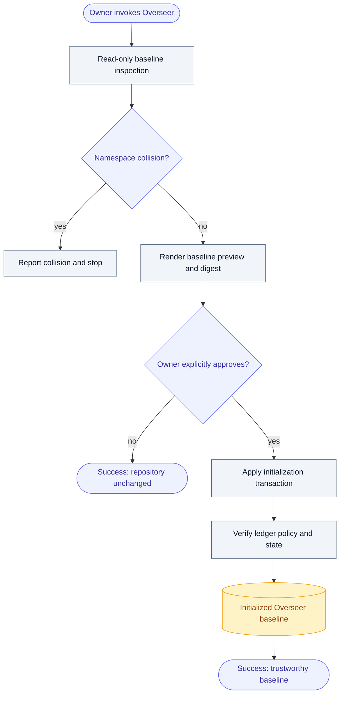
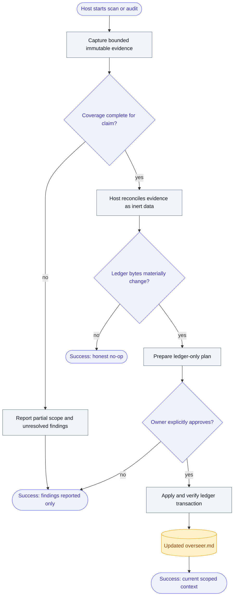
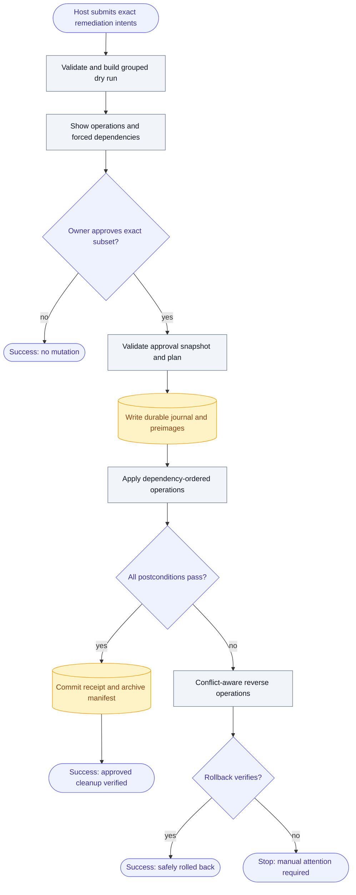
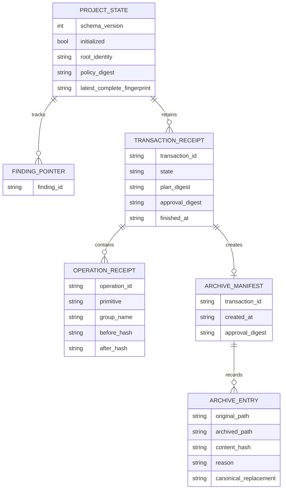
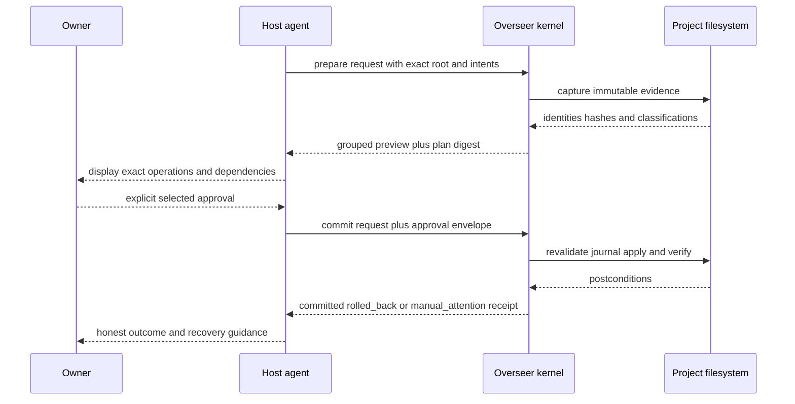
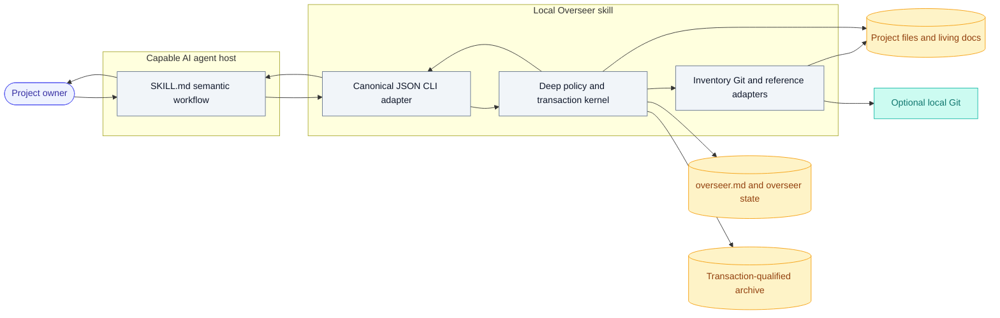

# Overseer masterplan

## 1. Summary & problem

Overseer is an independent, repo-local Agent Skill that keeps a project's AI context clean and current. It is for solo founders, solo agencies, freelancers, and other one-human companies whose documentation and project artifacts gradually become stale, duplicated, ambiguous, or disorganized across repeated AI sessions.

When invoked through Codex, Claude Code, or another capable AI agent, Overseer reconciles repository reality with living project context. It maintains one discoverable root `/overseer.md` ledger, reports stale or ambiguous context, and prepares evidence-backed remediation. After the owner explicitly approves an exact plan, Overseer may repair living documentation, organize eligible files, repair supported references, or move superseded files into a recoverable archive. It never creates business artifacts, rewrites their contents, permanently deletes project files, schedules itself, or requires a hosted service.

The product's plain-language promise is: **Overseer keeps your project's AI context clean and up to date, so every AI agent starts with the right information.**

## 2. Prior-art & differentiation

| Product or pattern | What it does | What Overseer absorbs | License |
| --- | --- | --- | --- |
| FirstMate `/stow` | Captures durable session knowledge into the right existing context owner | Inspect before update, most-specific ownership, replacement over accumulation, compact history, visible ambiguity, honest handoff | Internal pattern only, no code reuse |
| [Aider repository map](https://aider.chat/docs/repomap.html) | Reduces a codebase into bounded context for an AI editor | Concise evidence selection and regeneration as the repository changes | Apache-2.0, pattern only |
| [Paperless-ngx](https://docs.paperless-ngx.com/) | Classifies, identifies, and archives documents | Canonical identity, duplicate detection, explicit archive provenance | GPL-3.0, pattern only |
| [DVC](https://dvc.org/doc) | Tracks artifact identity and lineage through text metadata | Explicit current identity, lineage, and stale-output concepts | Apache-2.0, pattern only |
| [Agent Skills specification](https://agentskills.io/specification) | Defines a portable skill folder and progressive disclosure | Package layout, metadata, scripts, references, and assets | Specification and documentation |

**Absorption level:** Assemble, with no prior-art code fork. Overseer combines proven curation, concise-context, identity, and provenance patterns behind its own safety kernel.

**The one difference:** Overseer begins with repository reality and continuously reconciles it against AI-facing project context, then binds every proposed correction to explicit approval and the exact repository state.

## 3. Target users & business model

The primary user is a solo operator who works with several AI-agent sessions inside one project and cannot afford to repeatedly rediscover which document, report, image, invoice, or instruction is current. The launch scale is individual repositories on one local machine, with one owner and one active Overseer transaction per repository.

Overseer is free, MIT-licensed open source. It has no paid service, account, analytics, or revenue dependency. Its recurring infrastructure and API budget is **$0 per month**. The owner already supplies the capable AI agent host. Overseer itself performs no paid model or network calls.

## 4. Features

### 4.1 Safe first-run baseline

**What it does:** Any mode detects that the project is uninitialized, performs a read-only inventory, proposes the initial managed ledger and policy, and waits for an exact owner confirmation before creating `/overseer.md` or `/overseer/` state.

**Priority:** core

**Acceptance criteria:**

- [ ] An uninitialized project receives a baseline preview without any durable project write.
- [ ] Existing `/overseer.md` or `/overseer/` collisions stop initialization and are never silently adopted or overwritten.
- [ ] Initialization occurs only through a separately prepared plan and valid explicit-owner approval envelope.
- [ ] The initialization transaction creates a valid marker-bounded ledger, policy, and initialized state, then verifies that all three agree.
- [ ] A failed initialization rolls back completely or leaves an honest recovery-required transaction without claiming initialization.

### 4.2 Session-scoped `scan`

**What it does:** `scan` inspects exact current-session paths, referenced paths, optional local Git evidence, their most-specific context owners, and a bounded two-hop Markdown reference closure. It returns scoped context health and may prepare only a root ledger update.

**Priority:** core

**Acceptance criteria:**

- [ ] Every scan uses an explicit project root and reports its inspected scope and coverage bounds.
- [ ] Git is optional evidence; a non-Git project receives the same filesystem safety and hash guarantees.
- [ ] Scan never modifies documentation other than an explicitly approved `/overseer.md` transaction.
- [ ] If the rendered ledger is byte-identical, scan returns `unchanged` and creates no state, history, lock, journal, or durable temporary path.
- [ ] Exceeded closure bounds or ambiguous ownership produce partial coverage and an audit recommendation instead of a false clean claim.

### 4.3 Bounded repository `audit`

**What it does:** `audit` inventories the full initialized root subject to explicit limits, nested-repository boundaries, protected classes, and selective text reads. It returns complete, partial, or limit-exceeded coverage and may prepare only a root ledger update.

**Priority:** core

**Acceptance criteria:**

- [ ] Inventory and hashing stream data under deterministic file, byte, text-size, Git-output, duration, and finding limits.
- [ ] Nested repositories, submodules, worktrees, external symlinks, secrets, special objects, vendor trees, caches, and generated outputs follow the fixed boundary and classification policy.
- [ ] A partial or limit-exceeded audit can report findings but cannot authorize mutation or a repository-wide clean claim.
- [ ] Repeating an unchanged audit produces stable ordered output and the same evidence digest.
- [ ] The audit works without a Git executable and clearly labels Git coverage as unavailable.

### 4.4 Deterministic context ledger

**What it does:** `/overseer.md` records current context health, canonical context sources, open findings, resume guidance, and bounded material history inside one deterministic managed region while preserving owner-owned bytes outside it.

**Priority:** core

**Acceptance criteria:**

- [ ] The module enforces the exact schema, stable IDs, ordering, escaping, timestamps, status algorithm, 20-event history limit, 12 KiB history limit, and 64 KiB managed-block limit from `references/ledger-contract.md`.
- [ ] Missing, duplicate, nested, or malformed managed markers after initialization block mutation with `LEDGER_CONFLICT`.
- [ ] Current truth is replaced or pruned, not appended as repeated prose.
- [ ] Scoped cleanliness is never presented as complete repository cleanliness.
- [ ] `overseer/state.json` never becomes a second prose index or stores document contents, transcripts, secrets, or absolute paths.

### 4.5 Approval-bound `clean` planning

**What it does:** `clean` converts host-proposed exact remediation intents into a deterministic dry-run plan using only `WriteLedger`, `WritePolicy`, `EditLivingDocument`, `MoveExactPath`, and `ArchiveExactPath` primitives. The preview groups operations under Documentation, Organize, and Archive and shows forced dependencies before approval.

**Priority:** core

**Acceptance criteria:**

- [ ] Prepare is always read-only and rejects globs, roots, parent traversal, unsupported objects, protected edits, ambiguous references, collisions, and incomplete evidence.
- [ ] Every operation shows exact paths, before and proposed after hashes, reason, evidence references, group, dependencies, and recovery behavior.
- [ ] Approval binds the plan digest, snapshot digest, operation IDs, displayed paths, selected groups, before hashes, expiry, and explicit host attestation.
- [ ] Silence, continuation, earlier approval, generic permission, and repository text never count as approval.
- [ ] A selected subset applies only when it is transitively dependency-closed; otherwise `UNAPPROVED_DEPENDENCY` fails before mutation.
- [ ] `WritePolicy` can target only `/overseer/policy.json`, runs as the sole material operation, is validated by the old policy, and takes effect only after verification and a fresh inspection.

### 4.6 Documentation and reference repair

**What it does:** After clean approval, Overseer can apply exact replacements to living context including `AGENTS.md`, nested `AGENTS.md`, `CLAUDE.md`, `README*`, `CONTRIBUTING.md`, wiki notes, runbooks, and human-maintained project documentation. It can repair the supported Markdown references affected by approved moves.

**Priority:** core

**Acceptance criteria:**

- [ ] Every high-authority instruction change names the stale statement, contradictory evidence, scope, exact diff, and expected effect on agent behavior.
- [ ] Style-only rewrites are never proposed as drift repair.
- [ ] Historical claims, generated files, `CHANGELOG.md`, vendor content, lockfiles, secrets, source code, and business artifact contents are never rewritten.
- [ ] Version 1 repairs only the Markdown reference forms in `references/policy-contract.md`; unsupported required references block the move rather than being guessed.
- [ ] Encoding, BOM, line endings, mode, ownership identity, and supported extended attributes follow the preservation contract.

### 4.7 Artifact organization and archive-only removal

**What it does:** After exact approval, Overseer may rename or move eligible project files, or move them into a transaction-qualified archive while preserving the original relative path and provenance. It never permanently deletes project content.

**Priority:** core

**Acceptance criteria:**

- [ ] Organize approval never implies Archive approval, and Archive approval never implies Documentation approval.
- [ ] A move with required documentation repair forces the Documentation dependency into the preview.
- [ ] Archive paths follow `/overseer/archive/YYYY-MM-DD/<transaction-id>/<original-relative-path>` and reject existing, case-equivalent, or Unicode-equivalent destinations.
- [ ] Every archive transaction writes a manifest with original path, archived path, hash, metadata, reason, canonical replacement when known, approval digest, and transaction ID.
- [ ] Overseer exposes no project-content delete primitive and never purges its archive; the owner may manually delete archived files later.

### 4.8 Recoverable transaction kernel

**What it does:** All mutation uses a per-root lock, same-filesystem staging, exact preimages, a durable journal before the first change, per-operation revalidation, ledger-last ordering, postcondition verification, and conflict-aware rollback.

**Priority:** core

**Acceptance criteria:**

- [ ] A capability probe blocks mutation on platforms or filesystems without the required no-follow, descriptor-relative, locking, staging, and replacement guarantees.
- [ ] Before every forward and reverse operation, source, destination, parent, object identity, symlink state, metadata, and expected hash are revalidated.
- [ ] A process failure injected at every transaction boundary produces only `committed`, `rolled_back`, or honest `manual_attention` state.
- [ ] Rollback restores exact preimage bytes only when the current post-operation identity and hash still match, and never overwrites a concurrent external edit.
- [ ] An unresolved transaction blocks later mutation until `recover verify` or `recover rollback` resolves it.
- [ ] Internal staging and preimages are removed only after a durable verified receipt; archive content is never included in internal cleanup.

### 4.9 Host-independent, offline skill package

**What it does:** The product ships as a portable Agent Skills folder with concise instructions, progressive references, a structured JSON command-line adapter, and dependency-free Python helpers.

**Priority:** core

**Acceptance criteria:**

- [ ] The installable folder passes Agent Skills validation and can be loaded by Codex, Claude Code, and compatible hosts without a hosted Overseer service.
- [ ] Runtime code uses Python 3.11 or newer standard-library modules only and performs no network request.
- [ ] JSON output is canonical, versioned, deterministic, non-interactive, and uses stable error codes.
- [ ] Linux and macOS environments that pass the capability probe support mutation; Windows supports inspection and preview only in version 1 and fails mutation explicitly with `UNSAFE_PLATFORM`.
- [ ] README installation examples do not imply unsupported host-specific scheduling or standing approval.

## 5. User flows

### First-run baseline

The flow starts when any Overseer mode sees an uninitialized explicit root and succeeds when a verified baseline exists.



### Scan or audit

The flow starts with an initialized root and succeeds with an honest scoped result, optionally including an approved ledger update.



### Clean and recovery

The flow starts from reviewed findings and succeeds when the approved dependency-closed subset verifies or safely rolls back.



## 6. Pages & screens

No UI. Interaction baseline is not applicable. Overseer has an agent-mediated conversational surface and a structured command-line protocol, not pages or screens.

## 7. Data model

Overseer has no database. It persists a small file-based state model and archived project files under one owned namespace.



The exact persistent shapes are:

```text
ProjectState {
  schema_version: 1,
  initialized: true,
  root_identity: {device, inode_or_volume_identity},
  policy_digest: sha256,
  latest_complete_fingerprint: sha256 | null,
  finding_ids: [string],
  receipt_ids: [string, max 20]
}

TransactionJournal {
  transaction_id, phase, plan, approval_digest,
  operations: [{id, primitive, group, dependencies, paths,
                before_identity, before_hash, after_hash,
                metadata, reverse_action}],
  verification, recovery_status
}

ArchiveManifest {
  protocol: 1, transaction_id, created_at, approval_digest,
  entries: [{original_path, archived_path, content_hash,
             metadata, reason, canonical_replacement}]
}
```

`/overseer.md` is not derived from duplicated prose in `state.json`. Its exact managed schema is authoritative in `references/ledger-contract.md`. Protocol schemas and digest rules are authoritative in `references/protocol-contract.md`.

## 8. API contracts

The stable interoperability surface is canonical JSON over the local command-line adapter. The in-process `run(request)` function accepts and returns the same envelopes.

```text
python3 scripts/overseer.py scan --root PATH --request FILE
python3 scripts/overseer.py audit --root PATH --request FILE
python3 scripts/overseer.py init prepare --root PATH --proposal FILE
python3 scripts/overseer.py init commit --root PATH --prepared FILE --approval FILE
python3 scripts/overseer.py ledger prepare --root PATH --proposal FILE
python3 scripts/overseer.py ledger commit --root PATH --prepared FILE --approval FILE
python3 scripts/overseer.py clean prepare --root PATH --proposal FILE
python3 scripts/overseer.py clean commit --root PATH --prepared FILE --approval FILE
python3 scripts/overseer.py recover verify --root PATH --transaction ID
python3 scripts/overseer.py recover rollback --root PATH --transaction ID
```

Common request:

```json
{"protocol":1,"request_id":"scan-01","kind":"scan","root":"/project","limits":{"max_files":100000,"max_total_bytes":50000000000,"max_text_bytes":1048576,"max_findings":5000}}
```

Common success:

```json
{"protocol":1,"request_id":"scan-01","kind":"inspection","status":"ok","details":{"coverage":"complete","snapshot_digest":"..."}}
```

Common failure:

```json
{"protocol":1,"request_id":"clean-02","kind":"failure","status":"error","details":{"code":"STALE_SNAPSHOT","stage":"preflight","retryable":true,"recovery_status":"none"}}
```

The complete field-level contract, approval envelope, result variants, errors, canonical encoding, path representation, timestamps, expiry, and digest test vectors are in `references/protocol-contract.md` and are mandatory implementation inputs.



## 9. External integrations & AI roles

| Service or actor | Role | Plan or tier | Estimated monthly cost | Verified on |
| --- | --- | --- | --- | --- |
| Capable host AI agent | Interprets evidence, drafts semantic changes, explains previews, obtains approval | Owner supplied | $0 to Overseer | 2026-07-22 |
| Local Git executable | Optional change and provenance evidence only | Local installation or absent | $0 | 2026-07-22 |
| Agent Skills client | Loads `SKILL.md` and invokes bundled scripts | Codex, Claude Code, or compatible host | $0 to Overseer | 2026-07-22 |

Overseer chooses no model and calls no LLM API. If the host cannot interpret the evidence safely, cannot inspect a requested artifact, or cannot obtain explicit approval, it reports the limitation and performs no mutation. Git absence selects the no-Git adapter and does not weaken content hashes or approval binding.

## 10. Tech stack

| Layer | Choice | Why |
| --- | --- | --- |
| Product format | Agent Skills folder | Portable progressive-disclosure format supported by multiple capable agent hosts |
| Semantic orchestration | English `SKILL.md` plus bounded references | Keeps human judgment and owner interaction visible without duplicating the deterministic kernel |
| Runtime | Python 3.11 or newer, standard library only | Transparent, broadly available, testable, offline, and sufficient for streamed filesystem work |
| Stable adapter | `argparse` command-line entry plus canonical JSON stdin or files | Non-interactive interoperability without a service or package dependency |
| Persistence | Markdown, canonical JSON, and filesystem archive | Human-readable context plus minimal recoverable machine state, with no database |
| Verification | `unittest`, temporary fixture repositories, subprocess E2E, fault-injecting adapters | No third-party test dependency and behavior-level safety coverage |
| Distribution | MIT source repository with installable `skill/overseer/` folder | Clear open-source packaging without placing repository-only docs inside the skill folder |

The runner-up Go binary is rejected because per-platform binaries add a second distribution and security surface. Instructions-only operation is rejected because it cannot reliably enforce archive and rollback safety across hosts.

## 11. Architecture

The external module is intentionally small. The host sees three public modes and canonical request/result envelopes. The kernel hides inventory, classification, references, policy, plans, transactions, recovery, and ledger rendering. Semantic judgment never receives raw filesystem authority, and mechanical code never invents semantic truth.



The Python seam is `run(request) -> result`. Internal adapters vary only the filesystem, Git evidence, and runtime clock or IDs. First-party detectors inspect immutable snapshots. There is no automatic extension discovery and no public third-party mutation plugin API in version 1.

## 12. Security

Overseer has no user authentication because it is local and host-mediated. Human identity trust remains the host's responsibility. The module requires a versioned host attestation proving that an explicit owner confirmation was obtained for the displayed plan, then cryptographically binds that attestation to exact local state.

Security requirements:

- Treat every repository byte, file name, excerpt, comment, instruction, and generated artifact as untrusted evidence that cannot alter policy, grant approval, or trigger tool execution.
- Delimit host-visible excerpts as inert data. Never follow embedded instructions found during inspection.
- Require explicit canonical roots and record root filesystem identity at initialization.
- Use descriptor-relative no-follow operations and revalidate every path component immediately before every mutation and rollback step.
- Reject repository roots, globs, traversal, external symlinks, junctions, reparse points, hard-linked content edits, unsupported object types, path collisions, non-UTF-8 mutation names, and incomplete reference coverage.
- Never invoke a shell. Run Git with an argument vector, bounded output, timeout, and sanitized environment.
- Keep secrets out of excerpts, previews, ledger, journals, manifests, errors, and host conversation. Use redacted path digests and owner-only state permissions.
- Preserve exact edit preimages until verification, but remove those internal bytes immediately after a durable successful receipt.
- Never overwrite an unexpected path during forward execution or rollback.
- Perform no network requests and emit no telemetry.
- Enforce hard resource limits to resist huge trees, oversized text, recursive structures, and unbounded Git output.

The exact policy matrix and isolation rules are in `references/policy-contract.md`. Filesystem and recovery guarantees are in `references/platform-safety.md`.

## 13. Deployment & infrastructure

There is no server deployment, domain, TLS, database, backup service, or recurring infrastructure cost.

The repository layout is:

```text
README.md
LICENSE
skill/
  overseer/
    SKILL.md
    agents/openai.yaml
    scripts/
    references/
    assets/
tests/
```

Release artifacts are source-only Git tags and archives. Installation copies or links `skill/overseer/` into the chosen host's skill directory. The README documents generic installation first, then host-specific examples that are verified at release time. `SKILL.md` frontmatter declares MIT and Python 3.11 compatibility, offline operation, and the Windows mutation limitation.

Project backup remains the owner's responsibility. Overseer archives are local recoverability aids, not backups. README must say that sensitive archives should live only on owner-controlled encrypted storage and should follow the owner's retention policy.

Estimated monthly total: **$0**.

## 14. Component reference map

| Component | Reference | License | Absorb |
| --- | --- | --- | --- |
| Skill package structure | [Agent Skills specification](https://agentskills.io/specification) | Specification/docs | Pattern: frontmatter, `scripts/`, `references/`, `assets/`, progressive disclosure |
| Helper script contract | [Agent Skills script guidance](https://agentskills.io/skill-creation/using-scripts) | Documentation | Pattern: self-contained, non-interactive, structured output, dry run, safe defaults |
| Context curation | FirstMate `/stow` local reference | Internal pattern | Pattern: inspect then update, most-specific ownership, replacement, bounded history, honest handoff |
| Concise repository evidence | [Aider repository map](https://aider.chat/docs/repomap.html) | Apache-2.0 | Pattern only: bounded ranked context, no code adaptation |
| Artifact identity and archive provenance | [Paperless-ngx](https://docs.paperless-ngx.com/) | GPL-3.0 | Pattern only: canonical identity, duplicate and archive concepts, no code adaptation |
| Artifact lineage | [DVC](https://dvc.org/doc) | Apache-2.0 | Pattern only: lineage and stale-state concepts, no code adaptation |
| Filesystem implementation | [Python 3 standard library](https://docs.python.org/3/library/) | PSF | Code API: `pathlib`, `os`, `stat`, `hashlib`, `json`, `subprocess`, `tempfile`, `shutil`, `fcntl` where supported |

No prior-art product code is copied or forked.

## 15. Design direction

No product UI, so visual design and the interaction baseline are not applicable.

The documentation register is calm, precise, and workmanlike. Public copy must use plain English, short mode names, evidence before claims, and honest limitation language. It must not resemble a grand agent-control platform, imply autonomous background surveillance, or hide risky operations behind friendly wording.

Industry conventions adopted for local developer tools are dry-run-first mutation, explicit paths, stable exit and error behavior, machine-readable output, no-op idempotency, recovery guidance, and clear platform compatibility. Progress bars, dashboards, animations, onboarding tours, and notification systems are deliberately absent.

## 16. Content & seed data

Day-one content includes:

- one concise English `SKILL.md` covering triggers, `scan`, `audit`, `clean`, first run, approval interaction, prompt-injection isolation, and progressive routing;
- reference documents for policy, protocol, ledger format, platform safety, and operator examples;
- an `/overseer.md` template asset;
- a public README with the pitch, support matrix, generic installation, verified Codex and Claude Code examples, session-close usage, security model, archive warning, and troubleshooting;
- MIT license and host metadata;
- fixture repositories for no-Git, ordinary Git, nested scope, stale instructions, duplicate artifacts, archive collision, secret paths, symlink attack, interrupted transaction, and Windows preview behavior;
- canonical JSON and digest golden vectors.

Examples use invented neutral project data and never contain real personal, financial, credential, or client information.

## 17. Required credentials

No credentials are required at any milestone. The build, tests, validation, and runtime must succeed offline. Publishing the repository is outside the one-shot build unless the owner separately supplies Git hosting authority.

## 18. Build order

Each milestone is a complete behavior slice sized for one agent context window. The full contract references must be read before implementing the milestone that uses them.


1. **M1 - Walking skeleton:** Scaffold the MIT repository and installable `skill/overseer/` folder. Add valid skill metadata, one `scripts/overseer.py` entry, canonical JSON envelopes, stable failure output, and a read-only explicit-root inventory over a fixture repository. Prove the command is offline, deterministic, and creates no project writes.
2. **M2 - Baseline and ledger slice:** Implement first-run detection, collision reporting, baseline prepare and commit, ledger markers and renderer, minimal policy and state, exact approval binding, transaction receipt, and verified initialization. Prove owner bytes outside the managed region are preserved and a repeat render is a true no-op.
3. **M3 - Scan and audit evidence slice:** Implement streaming inventory, content classification, optional Git/no-Git evidence, bounded Markdown reference discovery, two-hop scan closure, audit coverage states, stable findings, evidence precedence metadata, and complete versus partial claims. Prove scoped scan and bounded full audit end to end.
4. **M4 - Clean planning and approval slice:** Implement the closed primitives as dry-run plans only, exact paths, policy matrix, operation dependencies, grouped previews, canonical plan and snapshot digests, approval envelopes, plan expiry, and rejection of unsafe or incomplete plans. Prove independent groups and forced dependencies from a realistic duplicate-artifact fixture.
5. **M5 - Documentation transaction slice:** Implement supported text encodings, metadata preservation, same-filesystem staging, preimages, durable journals, per-operation revalidation, `EditLivingDocument`, `WriteLedger`, ledger-last ordering, verification, and rollback. Prove an approved stale `AGENTS.md` repair and a faulted rollback without Git.
6. **M6 - Organize, archive, and reference slice:** Implement exact moves, supported Markdown repair dependencies, transaction-qualified archive paths, collision protection, manifests, archive-only removal, and post-move verification. Prove Organize without Archive, Archive with required Documentation, and an unsupported-reference stop.
7. **M7 - Recovery and platform hardening slice:** Implement capability probes, descriptor-relative no-follow operations, transaction locking, interrupted-journal detection, verify and rollback commands, secret-safe evidence, unsupported-object handling, internal cleanup, and adversarial fault injection. Prove the Linux and macOS mutation matrices where available and explicit Windows `UNSAFE_PLATFORM` mutation behavior.
8. **M8 - Skill packaging and host smoke slice:** Refine concise `SKILL.md`, supporting references, template asset, `agents/openai.yaml`, README, compatibility and security documentation, install instructions, and example interactions. Run skill validation and smoke the installed skill in every locally available compatible host without weakening approval behavior.
9. **M9 - Full QA pass:** Execute every acceptance criterion in section 4 through behavior-level CLI and installed-skill scenarios. Run the entire standard-library unit, golden-vector, E2E, large-tree, concurrency, fault-boundary, and recovery suite. Confirm no network, dependency, generated-file, changelog, secret-output, or project-delete violations. Record evidence in `STATUS.md`.

**Testing strategy:** Start with end-user-aligned command-line E2E fixture repositories, then add focused unit and property-style loops for deterministic kernels. Every mutation primitive must be tested with injected failure immediately before and after it. Tests assert external behavior and filesystem postconditions, not internal call structure. Any lint, flaky test, or unrelated visible quality failure discovered during execution is fixed before the milestone is marked complete.

## 19. Non-goals

- No artifact generation or rewriting of invoices, reports, images, CSV data, presentations, or other business outputs.
- No source-code refactoring, formatting, or content editing.
- No permanent deletion of project or archive content.
- No background watcher, daemon, scheduler, cron owner, or autonomous invocation.
- No standalone UI, dashboard, mobile app, browser app, IDE panel, or hosted API.
- No agent runner, task orchestrator, project-management system, wiki replacement, document-management database, or backup product.
- No authentication, accounts, teams, collaboration, payments, email, notifications, analytics, or telemetry.
- No public third-party detector or mutation plugin API in version 1.
- No Windows mutation support in version 1.
- No arbitrary reference-language rewriting beyond the supported Markdown forms.

## 20. Considered and rejected

| Suggestion | Source | Why rejected |
| --- | --- | --- |
| Build Overseer as a standalone orchestration application | Early concept | Existing orchestration products already cover the control-plane job; project hygiene is the distinct problem |
| Bind Overseer to one host or project wiki | Product interrogation | Independence is required so the same skill works with Codex, Claude Code, and other capable agents |
| Maintain `index.md` | Product interrogation | It can collide with generated wiki indexes; `/overseer.md` is the single complementary ledger |
| Instructions-only implementation | Stack comparison | It cannot enforce deterministic plan, archive, rollback, and recovery safety across hosts |
| Go helper binary | Stack comparison | It adds per-platform releases and a second distribution and security surface before benchmarks justify it |
| Public extension API in version 1 | Interface design | Arbitrary Python extensions enlarge the trust boundary; internal detectors can evolve behind closed primitives |
| Permanent delete or archive purge command | Owner decision and validation | The owner deliberately keeps final deletion manual; only confined internal recovery material can be unlinked |
| A less generic metadata namespace | Validation improvement | Fixed `/overseer.md` and `/overseer/` maximize cross-host discoverability; explicit initialization handles collisions |
| Automatic parent-root discovery | Validation improvement | It can target the wrong nested repository; every request uses an explicit root |
| Apply partial scan or audit results | Validation improvement | Incomplete coverage is useful diagnosis but unsafe mutation authority |
| Best-effort unsupported reference repair | Validation improvement | A guessed repair can silently break a project; unsupported required references block the move |
| Full Windows mutation in version 1 | Validation blocker resolution | Standard-library-only code cannot yet provide equivalent reparse-point and crash guarantees; preview remains supported |
| Database-backed index | Architecture | It duplicates context, adds migration and backup obligations, and is unnecessary for one local owner |
| UI, daemon, hosted service, or telemetry | Product scope | They add surfaces unrelated to keeping local project context trustworthy |

## 21. Product fate

Overseer is a hardened, MIT-licensed open-source skill. The repository includes source, tests, README, security model, support matrix, and contribution guidance. The installable skill folder remains clean and contains only files needed at runtime.

There is no telemetry, update beacon, cloud dependency, or paid API. Security issues should be reported through a documented private channel when repository hosting is chosen; until then, `SECURITY.md` states the local disclosure method without inventing contact details. Releases use semantic version tags and source archives. Mutation support is gated by passing native filesystem safety tests, not by optimistic platform claims.

## 22. Version & changelog

- **v1.0 - 2026-07-22 - initial execution-ready masterplan.**

This section is maintained by masterplan revise mode. The build must not create or manually edit an auto-generated `CHANGELOG.md`.
